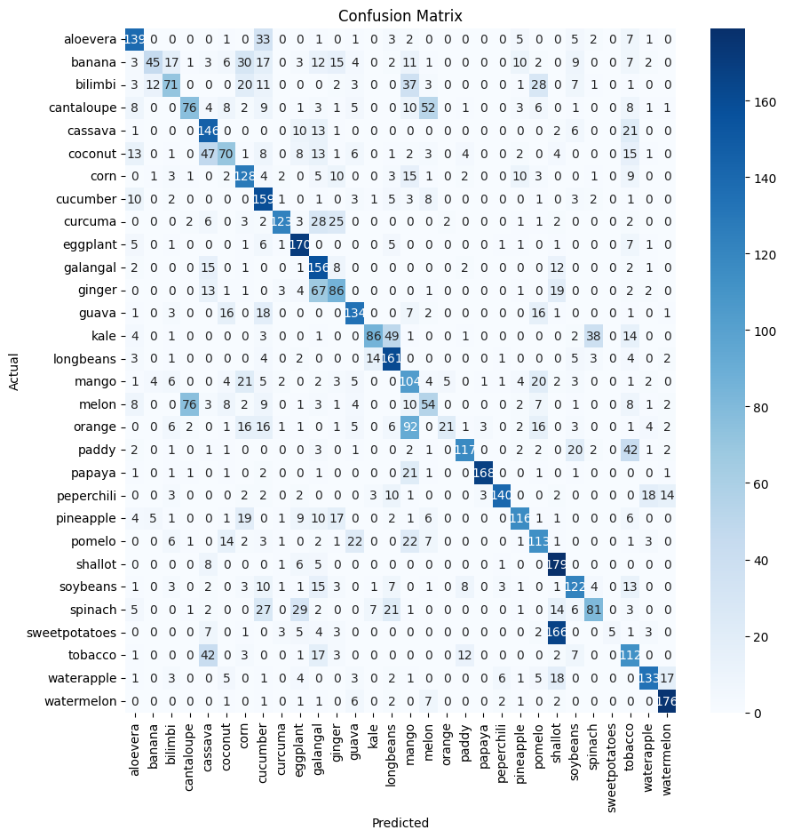
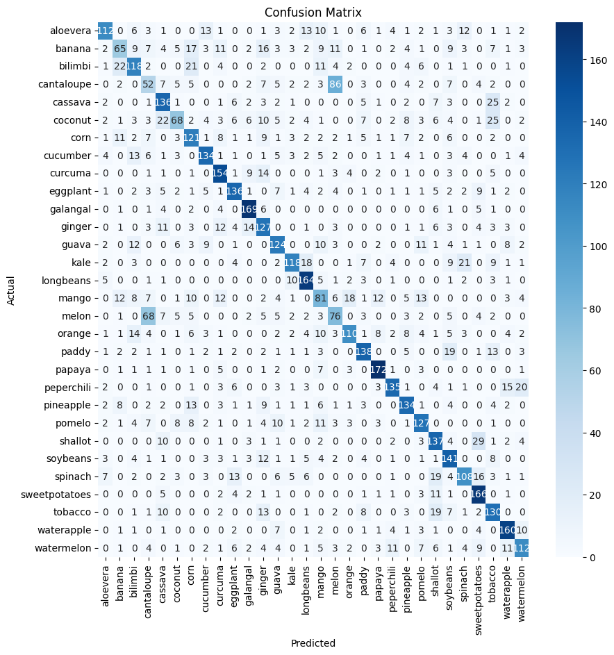
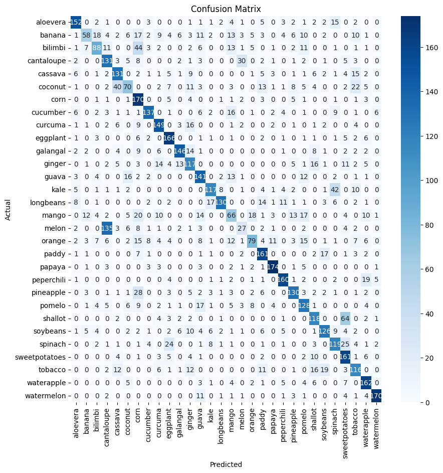
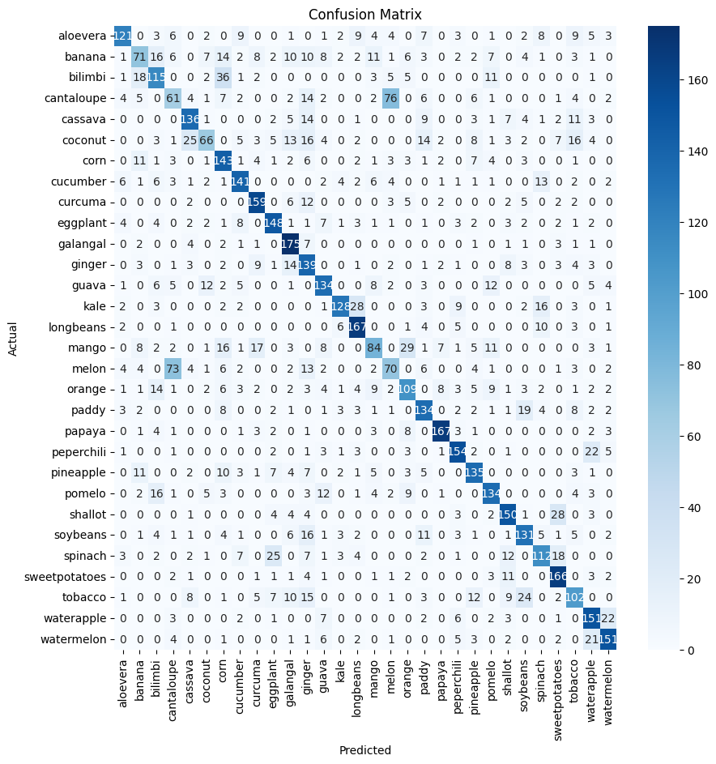

# **PLANTALYZE - Clasificación de especies de plantas**

## Descripción general
Plantalyze es un clasificador de especies de plantas mediante redes neuronales 
convolucionales (CNN), además de la inclusión de una capa cápsula convolucional 
como parte de la arquitectura experimental. El modelo trabaja sobre un dataset 
de 30,000 imágenes distribuidas en 30 especies de plantas, tomando como referencia principal 
el paper CapPlant (Samin, Omar & Mansoor, 2021).

## Modelos implementados
Se implementaron 6 modelos basados en redes neuronales convolucionales (CNN) para la clasificación de las especies de plantas. Los modelos implementados son:
1. **Modelo 0**: CNN con 7 capas convolucionales en pirámide inversa (128-32). 
2. **Modelo 1**: CNN con 4 capas convolucionales entrenada con Adam. 
3. **Modelo 2**: CNN con 4 capas convolucionales entrenada con Adam, data augmentation y early stopping.
4. **Modelo 3**: CNN con 4 capas convolucionales entrenada con SGD y early stopping.
5. **Modelo 4**: CNN con 4 capas convolucionales entrenada con SGD, data augmentation y early stopping.
6. **Modelo 5**: CNN con 4 capas convolucionales entrenada con Adam, data augmentation, early stopping y capa cápsula.

## Dataset

El dataset utilizado para el modelo es el [Plants Classification](https://www.kaggle.com/datasets/marquis03/plants-classification), el cual contiene 30000 imágenes de plantas de 30 especies diferentes. Cada especie de planta contiene 1000 imágenes.

Las clases presentes en el dataset son:
- aloevera
- banana
- bilimbi
- cantaloupe
- cassava
- coconut
- corn
- cucumber
- curcuma
- eggplant
- galangal
- ginger
- guava
- kale
- longbeans
- mango
- melon
- orange
- paddy
- papaya
- peperchili
- pineapple
- pomelo
- shallot
- soybeans
- spinach
- sweetpotatoes
- tobacco
- waterapple
- watermelon

### Split del dataset

El dataset obtenido desde Kaggle ya se encontraba dividido en los conjuntos de entrenamiento, validación y prueba, por lo que no fue necesario realizar un proceso de separación adicional (split). La distribución con la que ya se contaba es de 70% para entrenamiento (21000 imágenes), 10% para validación (3000 imágenes) y 20% para prueba (6000 imágenes). Para cada categoría de planta, se asignaron 700 imágenes para entrenamiento, 100 imágenes para validación y 200 imágenes para prueba. 

Los splits más comunes en la literatura son 70:30 o 80:20, por lo que la distribución que ya venía desde Kaggle fue bastante adecuada para el proyecto.

### Redimensionamiento de las imágenes

Las imágenes se redimensionaron de dos maneras distintas. Para el Modelo 0 se redimensionaron a 128×128 px (el paper de referencia usaba 500×500 px, tamaño inadecuado para este dataset). Para los Modelos 1–5 se redimensionaron a 224×224 px, siguiendo el estándar de CapPlant y otros papers consultados.

### Data Augmentation
Se utilizó data augmentation para los modelos 2, 4 y 5, con el objetivo de reducir el overfitting de los modelos. Las técnicas de data augmentation utilizadas fueron:

- **Rotation:** Rota aleatoriamente la imagen hasta +/- 10 grados.
- **Width shift:** Desplaza la imagen horizontalmente hasta un 20% de su ancho.
- **Zoom:** Aplica un zoom aleatorio de aproximadamente +/- 30%.
- **Horizontal flip:** Voltea la imagen horizontalmente con cierta probabilidad.

## Modelos

### Hiperparámetros

**Modelo 0**
- Batch size: 128
- Learning rate: 0.0001
- Epochs: 100
- Optimizador: Default de Keras (no especificado)

Varios de estos hiperparámetros fueron elegidos de manera arbitraria, ya que el paper de referencia no especificaba ninguno de ellos salvo las épocas que se podían encontrar en una de las imágenes de resultados. 

**Modelos 1–5**
- Batch size: 32
- Learning rate: 0.0002
- Epochs: 50
- Optimizador: Adam (Modelos 1–2 y 5), SGD (Modelos 3–4)

Los hiperparámetros base siguen lo indicado en CapPlant. El número de épocas se redujo de 100 a 50 ya que en las pruebas el modelo convergía antes de esa marca. A excepción del Modelo 5, al que se le asignaron 100 épocas.  
El cambio de optimizador a SGD y su justificación se detallan en la sección de cada modelo.

### Métricas 

Para cada modelo se reportan las siguientes métricas, siguiendo el formato del paper de referencia CapPlant (Samin, Omar & Mansoor, 2021):
- Loss
- Accuracy
- Precision
- Recall
- F1-Score

Dado que el dataset está balanceado y las métricas de *precision*, *recall* y *F1-score* presentan valores similares entre sí y consistentes con el *accuracy*, las conclusiones de cada modelo se apoyan principalmente en el *accuracy* de test y en la brecha de overfitting, sin dejar de considerar las demás métricas como evidencia complementaria del desempeño de los modelos.

### Modelo 0: CNN con 7 capas convolucionales en pirámide inversa (128-32)

[Modelo 0](./plantalyze_model_arq1_v1.ipynb)

El Modelo 0 está basado en el paper [Classification of color images of leathers tanned with different vegetable tannins by convolution neural network](https://doi.org/10.1016/j.measurement.2025.118600).

La arquitectura original de este paper se componía de 8 capas convolucionales e imágenes de entrada de 500x500 px. Dado que ese tamaño era inadecuado para este dataset, se redujeron las imágenes a 128x128 px, lo que llevó también a reducir el número de capas convolucionales a 7 (128x4 -> 64x2 -> 32x1). 

#### Resultados

| Metric    | Train  | Val    | Test   |
|-----------|--------|--------|--------|
| Loss      | 1.0029 | 1.6846 | 1.9058 |
| Accuracy  | 66.51% | 59.73% | 56.52% |
| Precision | —      | —      | 0.62   |
| Recall    | —      | —      | 0.57   |
| F1-Score  | —      | —      | 0.55   |

#### Conclusiones

El Modelo 0 obtuvo la *accuracy* más baja del proyecto (56.52% en test), con una brecha de ~10 puntos entre entrenamiento y test. El rendimiento limitado se explica principalmente por la incompatibilidad entre la arquitectura de referencia y el dataset utilizado. El paper de referencia se enfocaba en la clasificación de cuero, con un dataset de solo 144 imágenes, mientras que este proyecto se centra en la clasificación de plantas, con un dataset de 30,000 imágenes. Adicionalmente, el paper no justifica decisiones clave como los hiperparámetros o la elección de la arquitectura, lo que reduce la solidez de su propuesta. 

### Modelo 1: CNN con 4 capas convolucionales entrenada con Adam

[Modelo 1](./plantalyze_model_arq2_v1.ipynb)

El Modelo 1 está basado en el paper [CapPlant: a capsule network based
framework for plant disease classification](https://doi.org/10.7717/peerj-cs.752).

La arquitectura original de este paper se compone de 4 capas convolucionales e imágenes de 224x224 px. Los hiperparámetros se mantienen iguales a los mencionados en el paper. La capa cápsula no se implementa en este modelo, ya que se decidió implementarla en el Modelo 5 para evaluar su impacto de manera aislada.

#### Resultados

| Metric    | Train  | Val    | Test   |
|-----------|--------|--------|--------|
| Loss      | 0.0788 | 1.8981 | 2.3673 |
| Accuracy  | 95.64% | 67.03% | 62.08% |
| Precision | —      | —      | 0.62   |
| Recall    | —      | —      | 0.62   |
| F1-Score  | —      | —      | 0.62   |

#### Conclusiones

El Modelo 1 representa la línea base del proyecto y obtuvo una *accuracy* de 62.08% en test. Sin embargo, presenta el overfitting más severo de todos los modelos. Hay una brecha de ~33 puntos entre entrenamiento (95.64%) y test (62.08%), con una pérdida de 0.07 vs 2.36 respectivamente. Esto indica que el modelo memorizó el conjunto de entrenamiento sin generalizar. Para atender este problema en los siguientes modelos se implementarán técnicas para evitar el overfitting, como el data augmentation y el early stopping.

### Modelo 2: CNN con 4 capas convolucionales entrenada con Adam, data augmentation y early stopping para evitar overfitting

[Modelo 2](./plantalyze_model_arq2_v2.ipynb)

El Modelo 2 sigue basado en el paper [CapPlant: a capsule network based framework for plant disease classification](https://doi.org/10.7717/peerj-cs.752). Estas técnicas fueron obtenidas de los siguientes artículos:
- [¿Cómo combatir el overfitting en el Machine Learning?](https://codificandobits.com/tutorial/como-combatir-el-overfitting/)
- [8 técnicas sencillas para prevenir el sobreajuste](https://medium.com/data-science/8-simple-techniques-to-prevent-overfitting-4d443da2ef7d)

Se sigue manteniendo la misma arquitectura del Modelo 1, pero se implementan técnicas para evitar el overfitting, como lo son el data augmentation y el early stopping. El data augmentation aplica las técnicas mencionadas en la sección correspondiente, mientras que el early stopping detiene el entrenamiento si la *val_loss* no mejora después de 5 épocas consecutivas, lo que resultó en el paro anticipado del entrenamiento en la época 23.

#### Resultados

| Metric    | Train  | Val    | Test   |
|-----------|--------|--------|--------|
| Loss      | 1.0385 | 1.3012 | 1.3390 |
| Accuracy  | 67.94% | 66.53% | 63.33% |
| Precision | —      | —      | 0.64   |
| Recall    | —      | —      | 0.63   |
| F1-Score  | —      | —      | 0.63   |

#### Conclusiones

El Modelo 2 redujo drásticamente el overfitting respecto al Modelo 1. La brecha entre entrenamiento y test pasó de ~33 puntos a solo ~4 puntos (67.94% vs 63.33%), con una pérdida de 1.03 vs 1.33 respectivamente. La *accuracy* en test aumentó de 62.08% a 63.33%, una mejora modesta en valor absoluto pero con una generalización más sólida. 

### Modelo 3: CNN con 4 capas convolucionales entrenada con SGD y early stopping

[Modelo 3](./plantalyze_model_arq2_v3.ipynb)

El Modelo 3 sigue basado en el paper [CapPlant: a capsule network based
framework for plant disease classification](https://doi.org/10.7717/peerj-cs.752).
Pero la parte del optimizer SGD se basa en los papers [DEEP INTERPRETABLE ARCHITECTURE FOR PLANT DISEASES CLASSIFICATION](https://arxiv.org/abs/1905.13523) y [Dual-Stream Architecture Enhanced by Soft-Attention Mechanism for Plant Species Classification](https://doi.org/10.3390/plants13182655), ambos enfocados en la clasificación de plantas.

Se mantuvo la misma arquitectura utilizada en el Modelo 2, pero sin aplicar técnicas de data augmentation y sustituyendo el optimizador por SGD. Esta decisión se tomó debido a que varios de los artículos revisados sobre clasificación de plantas empleaban dicho optimizador. Por ello, se planteó la hipótesis de que su uso podría mejorar el desempeño del modelo, por lo que se decidió evaluar su impacto en los resultados obtenidos.

#### Resultados

| Metric    | Train  | Val    | Test   |
|-----------|--------|--------|--------|
| Loss      | 0.1299 | 1.4506 | 1.7037 |
| Accuracy  | 95.80% | 68.93% | 64.23% |
| Precision | —      | —      | 0.64   |
| Recall    | —      | —      | 0.64   |
| F1-Score  | —      | —      | 0.64   |

#### Conclusiones

Comparado con el Modelo 2, el Modelo 3 obtiene una *accuracy* de prueba prácticamente igual (64.23% vs 63.33%), pero la brecha de overfitting regresó de ~4 puntos a ~31 puntos (95.80% vs 64.23%), con una pérdida de 0.13 vs 1.70 respectivamente. Esto confirma que fue el data augmentation, y no el optimizador Adam, el principal responsable de la generalización del Modelo 2. El Modelo 4 combinará SGD con data augmentation para evaluar si ambas técnicas juntas superan los resultados previos. 

### Modelo 4: CNN con 4 capas convolucionales entrenada con SGD, data augmentation y early stopping para evitar overfitting

[Modelo 4](./plantalyze_model_arq2_v4.ipynb)

El Modelo 4 sigue basado en el paper [CapPlant: a capsule network based framework for plant disease classification](https://doi.org/10.7717/peerj-cs.752), los papers de SGD mencionados en el Modelo 3 y las técnicas de regularización del Modelo 2.  

Se mantiene la arquitectura del Modelo 3 y se reincorpora el data augmentation. El objetivo es evaluar si la combinación de SGD y data augmentation supera los resultados obtenidos por cada técnica de forma individual. 

#### Resultados

| Metric    | Train  | Val    | Test   |
|-----------|--------|--------|--------|
| Loss      | 1.0096 | 1.2268 | 1.2380 |
| Accuracy  | 68.64% | 66.40% | 65.85% |
| Precision | —      | —      | 0.67   |
| Recall    | —      | —      | 0.66   |
| F1-Score  | —      | —      | 0.65   |

#### Conclusiones

El Modelo 4 es el mejor modelo hasta el momento del proyecto, con una *accuracy* de 65.85% en test y una brecha de overfitting de solo ~3 puntos (68.64% vs 65.85%), con una pérdida de 1.01 vs 1.23 respectivamente. Esto indica que la combinación de SGD y data augmentation es efectiva para mejorar el desempeño del modelo, superando los resultados obtenidos por cada técnica de forma individual.

### Modelo 5: CNN con 4 capas convolucionales entrenada con Adam, data augmentation, early stopping y capa cápsula

#### Redes de cápsulas (Capsule Networks)

**Introducción**

Las CNN consiguen los mejores resultados para clasificación de imágenes, sin embargo, son bastante deficientes clasificando objetos en diferentes posiciones, por lo que para conseguir un buen rendimiento requieren grandes cantidades de datos de entrenamiento que incluyan múltiples variaciones. Esto se debe a que las CNN son invariantes a traslaciones locales gracias al pooling, pero no manejan bien rotaciones o cambios de escala significativos sin suficiente data augmentation. Cambios más radicales no se gestionan bien debido a la función de agrupación que desecha información valiosa de la imagen para aumentar el campo de visión en las capas más profundas. 

Para solucionar este problema, Geoffrey Hinton propuso las redes de cápsulas (Capsule Networks). Él explica que el cerebro está dividido en módulos que pueden considerarse como cápsulas. Una cápsula es un grupo de neuronas cuya salida no es un único valor escalar sino un vector. La **longitud** de este vector representa la probabilidad de que exista un objeto en la entrada actual y la **dirección** del vector representa los parámetros de dicho objeto (posición, rotación, escala, etc.). Las cápsulas inferiores predicen la salida de las cápsulas superiores, esto a través de un algoritmo llamado "enrutamiento dinámico" (dynamic routing). Si la predicción de la cápsula inferior se alinea con la de nivel superior, el valor resultante se amplifica, mientras que si no se alinea, se reduce.

**Función de activación "squash"**

Las cápsulas utilizan una función de activación llamada "squash" para asegurar que la longitud del vector de salida esté entre 0 y 1, lo que permite interpretar la longitud como una probabilidad.

$$\mathbf{v}_j = \frac{\|\mathbf{s}_j\|^2}{1 + \|\mathbf{s}_j\|^2} \cdot \frac{\mathbf{s}_j}{\|\mathbf{s}_j\|}$$

Donde:
- $\mathbf{s}_j$ — vector de entrada a la cápsula $j$
- $\|\mathbf{s}_j\|^2$ — magnitud del vector al cuadrado
- $\frac{\|\mathbf{s}_j\|^2}{1 + \|\mathbf{s}_j\|^2}$ — factor de compresión, siempre en $[0, 1)$
- $\frac{\mathbf{s}_j}{\|\mathbf{s}_j\|}$ — vector unitario que preserva la dirección
- $\mathbf{v}_j$ — vector de salida con longitud comprimida

**Ejemplo de funcionamiento**

Para ejemplificarlo, supongamos que el modelo clasifica barcos (casco rectangular y vela triangular inclinada 45°) y casas (pared rectangular y techo triangular horizontal). Si la imagen muestra un rectángulo con un triángulo inclinado 45°, la cápsula del barco se activará con alta confianza. Si en cambio el triángulo aparece horizontal encima del rectángulo, la cápsula de la casa será la dominante. Esta sensibilidad a la posición y orientación relativa de las partes es precisamente lo que diferencia a las cápsulas de una CNN convencional.

Cuando una cápsula detecta fuertemente su objeto, produce un vector de gran magnitud. La función *squash* comprime esa magnitud a un valor entre 0 y 1, permitiendo interpretarla como la probabilidad de que el objeto esté presente en la imagen.

---

[Modelo 5](./plantalyze_model_arq2_v5.ipynb)

El Modelo 5 sigue basado en el paper [CapPlant: a capsule network based framework for plant disease classification](https://doi.org/10.7717/peerj-cs.752) y las técnicas de regularización del Modelo 2 y el Modelo 4.

Se mantiene la arquitectura del Modelo 4 pero se añade una capa cápsula convolucional después de la última capa convolucional. Para esta última iteración se decidió ser fiel al paper de referencia y seguir la implementación como se propone, volviendo así a utilizar el optimizador Adam. Cabe mencionar que el paper no realiza data augmentation, pero se decidió mantenerla ya que los experimentos previos mostraron que sin esta técnica el overfitting se agravaba significativamente, para asegurar así una mejor generalización del modelo.

#### Resultados

| Metric    | Train  | Val    | Test   |
|-----------|--------|--------|--------|
| Loss      | 0.7989 | 0.9177 | 0.9427 |
| Accuracy  | 74.57% | 73.97% | 72.45% |
| Precision | —      | —      | 0.73   |
| Recall    | —      | —      | 0.72   |
| F1-Score  | —      | —      | 0.72   |

#### Conclusiones

El Modelo 5 es el mejor modelo del proyecto, con una *accuracy* de 72.45% en test y una brecha de overfitting de solo ~2 puntos (74.57% vs 72.45%), con una pérdida de 0.79 vs 0.94 respectivamente. Esto indica que la adición de la capa cápsula mejoró el desempeño del modelo, superando los resultados obtenidos por el Modelo 4, que no contaba con dicha capa. Cabe señalar que este modelo recuperó el optimizador Adam, por lo que la mejora en el desempeño no se puede atribuir exclusivamente a la capa cápsula.

Sin embargo, la mejora en *accuracy* fue de solo ~6 puntos (72.45% vs 65.85%), lo que sugiere que la capa cápsula contribuyó a una mejora modesta en el desempeño del modelo. Se esperaba una mejora más significativa, ya que en el paper de referencia presentaban métricas de *accuracy* superiores al 90%, aunque es importante mencionar que el dataset utilizado en dicho paper era diferente al de este proyecto, por lo que la comparación no es directa. Por otro lado, el objetivo del paper era detectar enfermedades en plantas, mientras que el objetivo de este proyecto es clasificar especies de plantas, por lo que también se trata de tareas distintas. Podríamos inferir que la capa cápsula es más efectiva para detectar patrones relacionados con enfermedades en plantas, que para clasificar especies de plantas, aunque esto requeriría una investigación más profunda para confirmarlo.

### Conclusiones generales

**Entrenamiento**

| Métrica  | Modelo 0 | Modelo 1 | Modelo 2 | Modelo 3 | Modelo 4 | Modelo 5 |
|----------|----------|----------|----------|----------|----------|----------|
| Loss     | 1.0029   | 0.0788   | 1.0385   | 0.1299   | 1.0096   | 0.7989   |
| Accuracy | 66.51%   | 95.64%   | 67.94%   | 95.80%   | 68.64%   | 74.57%   |

**Validación**

| Métrica  | Modelo 0 | Modelo 1 | Modelo 2 | Modelo 3 | Modelo 4 | Modelo 5 |
|----------|----------|----------|----------|----------|----------|----------|
| Loss     | 1.6846   | 1.8981   | 1.3012   | 1.4506   | 1.2268   | 0.9177   |
| Accuracy | 59.73%   | 67.03%   | 66.53%   | 68.93%   | 66.40%   | 73.97%   |

**Prueba**

| Métrica  | Modelo 0 | Modelo 1 | Modelo 2 | Modelo 3 | Modelo 4 | Modelo 5 |
|----------|----------|----------|----------|----------|----------|----------|
| Loss     | 1.9058   | 2.3673   | 1.3390   | 1.7037   | 1.2380   | 0.9427   |
| Accuracy | 56.52%   | 62.08%   | 63.33%   | 64.23%   | 65.85%   | 72.45%   |

La progresión en los resultados a través de los distintos modelos permite tener conclusiones claras sobre el impacto de cada técnica implementada. 

Quizá el hallazgo más relevante es que el data augmentation fue la técnica más efectiva para reducir el overfitting, ya que su implementación en el Modelo 2 redujo la brecha entre entrenamiento y test de ~33 puntos a solo ~4 puntos, siendo esto confirmado por el Modelo 3, que al eliminar el data augmentation la brecha regresó a ~31 puntos con una *accuracy* de test prácticamente igual.

La combinación de data augmentation y SGD en el Modelo 4 produjo el mejor resultado entre los modelos CNN puros, con una *accuracy* de 65.85% en test y una brecha de overfitting de solo ~3 puntos. 

Finalmente, la adición de la capa cápsula en el Modelo 5 representó la mejora más significativa del proyecto, con una *accuracy* de 72.45% en test (+6 puntos respecto al Modelo 4) y una brecha de solo ~2 puntos. Sin embargo, como se mencionó anteriormente, el Modelo 5 también recuperó el optimizador Adam, por lo que la mejora en el desempeño no se puede atribuir exclusivamente a la capa cápsula.

## Disclaimer

Para el formato de este README y la presentación de los datos en los distintos notebooks se tomó como referencia el formato utilizado por el ingeniero Daniel Cajas en su proyecto [Animal Classifier](https://github.com/DanielSebasCM/ml_benji/) y mi compañera Mónica Martínez en su proyecto [Modelos Lineales y No Lineales para la Predicción de la Esperanza de Vida: Implementación Manual y Comparativa con Random Forest](https://github.com/MonicaMMartinezV/Mod2.ImplementacionTecnicaDeAprendizajeMaquina).

## Autor

**Daniel Emilio Fuentes Portaluppi**

*Tec de Monterrey*

*[a01708302@tec.mx](mailto:a01708302@tec.mx)*

## Referencias
Marquis03. (2023). Plants Classification. Kaggle. https://www.kaggle.com/datasets/marquis03/plants-classification

Omur, S., Efendioglu, N. O., & Sinecen, M. (2025). Classification of color images of leathers tanned with different vegetable tannins by convolution neural network. Measurement, 257, 118600. https://doi.org/10.1016/j.measurement.2025.118600

Samin, O. B., Omar, M., & Mansoor, M. (2021). CapPlant: a capsule network based framework for plant disease classification. PeerJ Computer Science, 7, e752. https://doi.org/10.7717/peerj-cs.752

M. Brahimi, S. Mahmoudi, K. Boukhalfa, and A. Moussaoui, "Deep interpretable architecture for plant diseases classification," arXiv preprint arXiv:1905.13523, 2019. [Online]. Available: https://arxiv.org/abs/1905.13523

Khan, I. U., Khan, H. A., & Lee, J. W. (2024). Dual-Stream architecture enhanced by Soft-Attention mechanism for plant species classification. Plants, 13(18), 2655. https://doi.org/10.3390/plants13182655

Chuan-En Lin, D. (2020, June). 8 técnicas sencillas para prevenir el sobreajuste. Medium. Retrieved May 31, 2026, from https://medium.com/data-science/8-simple-techniques-to-prevent-overfitting-4d443da2ef7d

¿Cómo combatir el overfitting en el Machine Learning? | Codificando Bits. (2025, September 11). Codificando Bits. https://codificandobits.com/tutorial/como-combatir-el-overfitting/

Lee, A. (2024, May 30). Adam vs SGD : What are the optimizers in neural network and when do we use? Medium. Retrieved May 31, 2026, from https://medium.com/@pumadd1227/adam-vs-sgd-what-are-the-optimizers-in-neural-network-and-when-do-we-use-238478a0eaea

Sabour, S., Frosst, N., & Hinton, G. E. (2017). Dynamic routing between capsules. arXiv (Cornell University). https://doi.org/10.48550/arxiv.1710.09829

Aurélien Géron. (2017, November 21). Capsule Networks (CapsNets) – tutorial [Video]. YouTube. https://www.youtube.com/watch?v=pPN8d0E3900

Aurélien Géron. (2017b, November 30). How to implement CapsNets using TensorFlow [Video]. YouTube. https://www.youtube.com/watch?v=2Kawrd5szHE

Desire. (n.d.). Capsule-Network-and-CNN-Keras-Implementation-on-MNIST-Dataset/Keras Implementation of CNN and Capsule Network on MNIST .ipynb at master · Desire100/Capsule-Network-and-CNN-Keras-Implementation-on-MNIST-Dataset. GitHub. https://github.com/Desire100/Capsule-Network-and-CNN-Keras-Implementation-on-MNIST-Dataset/blob/master/Keras%20Implementation%20of%20CNN%20and%20Capsule%20Network%20on%20MNIST%20.ipynb

DanielSebasCM. (n.d.). GitHub - DanielSebasCM/ml_benji. GitHub. https://github.com/DanielSebasCM/ml_benji/

MonicaMMartinezV. (n.d.). GitHub - MonicaMMartinezV/Mod2.ImplementacionTecnicaDeAprendizajeMaquina. GitHub. https://github.com/MonicaMMartinezV/Mod2.ImplementacionTecnicaDeAprendizajeMaquina